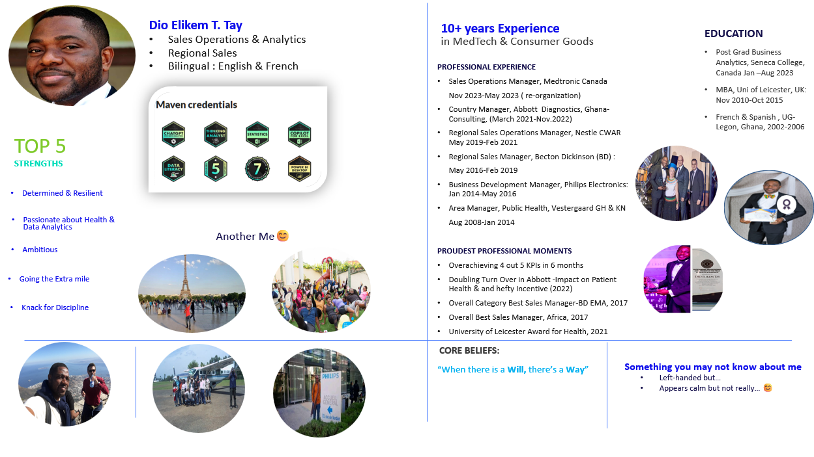

# Bio
- A dynamic, bilingual Commercial Operations, Analytics and Regional Sales leader with over 10 years of experience delivering exceptional sales growth and optimizing commercial effectiveness.
- Proven track record of driving topline growth of 5–10% CAGR at top-tier MedTech and Consumer Goods companies, including Medtronic, Abbott, Becton Dickinson (BD), and Nestlé.
- Recognized for my inspiring leadership, effective coaching and exemplary collaboration across functions, thriving in multicultural environments in both English and French.
- Passionate about improving lives through the power of healthcare, leveraging expertise in business analytics, strategic management, consultative selling, and cross-functional collaboration.

