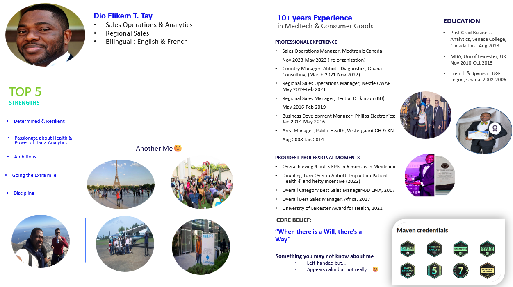

# Bio
- A dynamic bilingual Commercial Operations, Analytics & Regional Sales leader with over 10 years of experience driving sales growth and optimized commercial effectiveness outcomes in the MedTech and Consumer Goods industries.
- Passionate about improving people's lives through the power of health technologies and data analytics, I excel in leveraging business analytics, strategic management, consultative selling and cross-functional collaboration to deliver 
  outstanding commercial effectiveness outcomes,
- Driving topline growth of 5-10% CAGR in top tier companies including Medtronic, Abbott, Becton Dickinson (BD), and Nestlé.
- Recognized for leadership, coaching, exemplary cross fucntional collaboration and ability to thrive in English and French-speaking multicultural environments.

